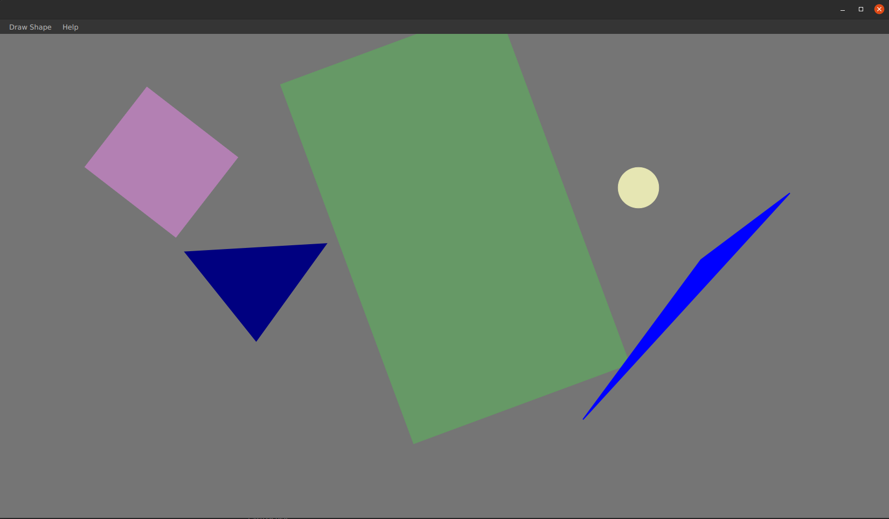

# Project Name
> Outline a brief description of your project.
> Live demo [_here_](https://www.example.com). <!-- If you have the project hosted somewhere, include the link here. -->

## Table of Contents
* [General Info](#general-information)
* [Technologies Used](#technologies-used)
* [Features](#features)
* [Screenshots](#screenshots)
* [Setup](#setup)
* [Project Status](#project-status)
* [To do](#to-do)
* [Contact](#contact)
<!-- * [License](#license) -->

## General Information
- Provide general information about your project here.
- What problem does it (intend to) solve?
- What is the purpose of your project?
- Why did you undertake it?
<!-- You don't have to answer all the questions - just the ones relevant to your project. -->

## Technologies Used
- Java 17
- JavaFX - 19-ea+8

## Features
List the ready features here:
- Drawing shapes e.g. triangle
- Editing shapes e.g. resizing, rotating, recoloring
- Moving shapes within the board

## Screenshots

<!-- If you have screenshots you'd like to share, include them here. -->

## Setup
For fastest setup you need IntelliJ and just click run. If you don't have Intellij, download Java SE Development Kit 17 and maven. All of dependencies are in pom.xml file.

## Project Status
Project in in progress.

## To do:
- Exporting/importing board to/from file
- Drawing on the board with pen, pencil, etc.

## Contact
Created by [@MichalZurawski](https://github.com/MichalZurawski02) - feel free to contact me!
